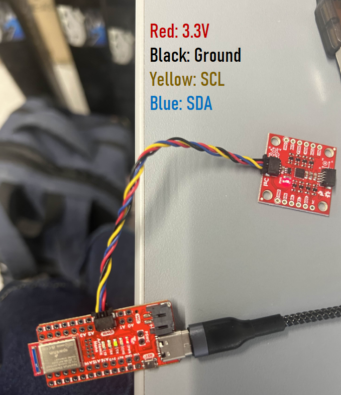

+++
title = "Lab 2: IMU"
description = "This lab introduces the IMU"
date = "2026-02-10"

[taxonomies]
tags = ["ece5160", "Artemis", "C Programming", "IMU", "FFT", "Low Pass Filtering"]
+++

# Lab Tasks
This lab explores an Inertial Measurement Unit (IMU), specifically the [Sparkfun breakout board](https://www.sparkfun.com/sparkfun-9dof-imu-breakout-icm-20948-qwiic.html). This board has an accelerometer, gyrocrope, and magnetometer on the boards X, Y, and Z axis. This lab explores use of the accelerometer and gyroscope, noise analysis for low pass filtering, and using a complementary filter for optimal angle estimation.

## IMU Set Up
The IMU is connected to the Artemis with a Qwiic connect able with 4 wires: Power (3.3 V), Ground, Clock (SCL), and Data (SDA). 

## AD0_VAL and I2C
I2C commincation is used fairly often with sensors and other devices that need to write data to an area where it can be read by a microcontroller. I2C uses a clock to synchronize data reads from a specified memory location on the IMU. The IMU will transmit data on the SDA line synchronized with SCL.

The IMU example code itself describes the `AD0_VAL` as `"the value of the last bit of the I2C address"`. This value defaults as 1 but can be changed to 0 to allow multiple IMUs (or I2C devices in general) to attach to different I2C commincation addresses. 

## IMU Example Code
We run the IMU example code. I could see the acceleration raw readings range from about -1000 to 1000 as the board was spun 360 degrees on all its axis.

<iframe width="560" height="315" src="https://www.youtube.com/embed/SCR4AWbkjnM?si=n9EkuiYxlHbWS2wP" title="YouTube video player" frameborder="0" allow="accelerometer; autoplay; clipboard-write; encrypted-media; gyroscope; picture-in-picture; web-share" referrerpolicy="strict-origin-when-cross-origin" allowfullscreen></iframe>

## Data Observations

# Accelerometer
## Calculating and Calibrating Roll and Pitch

## Data Speed and Accuracy

## FFT and Low Passing Noise

# Gyroscope

## Raw Gyroscope Readings

## Complementary Filter Readings
I orginially 

# Sample Data

# Stunt

After playing around with my RC car, I observed the car's natural drifting, turning speed/accuracy, and how easy it was to flip the bot over (either by driving into a wall or rapidally switching directions). I noted that telling the bot to drive 'straight' resulted in the car taking a pretty heavy curve. It was pretty easy to get the car to only have 1 or 2 wheel touching the ground causing a straight command to result in the car spinning in a circle (as shown in the video).

Shao and I also (accidently) observed that the RC car can drive on its side.

# Collaboration
This lab was worked on with consultation from Shao Stassen. We worked together more closely for the Stunt section. Aidan McNay's student page was also consulted. 

## Resources

[Qwiic Connect Guide](https://www.sparkfun.com/qwiic)
[ArduinoDocs I2C Guide](https://docs.arduino.cc/learn/communication/wire/)

[Alphabold FFT Tutorial](https://www.alphabold.com/fourier-transform-in-python-vibration-analysis/#elementor-toc__heading-anchor-1)
[SciPy Butter](https://docs.scipy.org/doc/scipy-1.17.0/reference/generated/scipy.signal.butter.html)
[SciPy Filtfilt](https://docs.scipy.org/doc/scipy-1.17.0/reference/generated/scipy.signal.filtfilt.html)