+++
title = "Lab 2: IMU"
description = "This lab introduces the IMU"
date = "2026-02-10"

[taxonomies]
tags = ["ece5160", "Artemis", "C Programming", "IMU", "FFT", "Low Pass Filtering"]
+++

# Lab Tasks
This lab explores an Inertial Measurement Unit (IMU), specifically the [Sparkfun breakout board](https://www.sparkfun.com/sparkfun-9dof-imu-breakout-icm-20948-qwiic.html). This board has an accelerometer, gyrocrope, and magnetometer on the boards X, Y, and Z axis. This lab explores use of the accelerometer and gyroscope, noise analysis for low pass filtering, and using a complementary filter for optimal angle estimation.


## IMU Set Up
The IMU is connected to the Artemis with a Qwiic connect able with 4 wires: Power (3.3 V), Ground, Clock (SCL), and Data (SDA). 


## AD0_VAL and I2C
I2C commincation is used fairly often with sensors and other devices that need to write data to an area where it can be read by a microcontroller. I2C uses a clock to synchronize data reads from a specified memory location on the IMU. The IMU will transmit data on the SDA line synchronized with SCL.

The IMU example code itself describes the `AD0_VAL` as `"the value of the last bit of the I2C address"`. This value defaults as 1 but can be changed to 0 to allow multiple IMUs (or I2C devices in general) to attach to different I2C commincation addresses. 

## IMU Example Code
We run the IMU example code. I could see the acceleration raw readings range from about -1000 to 1000 as the board was spun 360 degrees on all its axis.

<iframe width="560" height="315" src="https://www.youtube.com/embed/SCR4AWbkjnM?si=n9EkuiYxlHbWS2wP" title="YouTube video player" frameborder="0" allow="accelerometer; autoplay; clipboard-write; encrypted-media; gyroscope; picture-in-picture; web-share" referrerpolicy="strict-origin-when-cross-origin" allowfullscreen></iframe>

## Data Observations
TODO: Fill this out with information about gyroscrop and accelermeter and roll pitch yaw

# Accelerometer
## Calculating and Calibrating Roll and Pitch
The acceleraometer reads acceleration, or force per mass, being applied to the IMU. When the IMU is stationary, the only force applied to it is gravity. We can use 2 of the raw acceleromter readings to determine the angle of the board for both pitch and roll. In the case of roll, as shown below, we can use the obervation that $a_z = g*\cos(\theta)$ and that $a_x = g*\sin(\theta)$ to determine that the angle $\theta = tan^{-1}(a_x/a_z)$. Since we want $\theta$ to be the correct sign, we use the function $atan2$ to get an angle in radians between $-\pi/2$ and $\pi/2$. The same logic applies to finding the pitch, where $\phi = atan2(a_y, a_z)$. We use these equations with the accelerometer readings to determine roll and pitch.

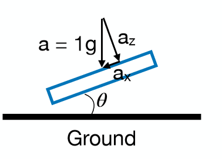

```c
#ifdef USE_SPI
float roll_calc_accel(ICM_20948_SPI *sensor) {
#else
float roll_calc_accel(ICM_20948_I2C *sensor) {
#endif
  return atan2(sensor->accX(), sensor->accZ()) / M_PI * 180.0; 
}


#ifdef USE_SPI
float pitch_calc_accel(ICM_20948_SPI *sensor) {
#else
float pitch_calc_accel(ICM_20948_I2C *sensor) {
#endif
  return atan2(sensor->accY(), sensor->accZ()) / M_PI * 180.0;
}
```


To callibrate, I started by observing the IMU roll and pitch readings for -90°, 0°, and 90°. I used the edge of the lab table as reference for ground truth degree measurements. I observed that the accelerometer readings were about one degree off of expected. I chose to calibrate the IMU by shifting based on the 0° output, then scaling the values based on the -90° and 90° readings. For example, for the pitch, I added 1° to shift 0 into the right location, then scaled by $\frac{180}{91.1-(-89.1)} \approx .999$. My calibration equations are as follows:

Roll: $\phi_{actual} = 1.01294(\phi_{measured}+0.21)$

Pitch: $\theta_{actual} = 0.998890(\theta_{measured}+1.0)$

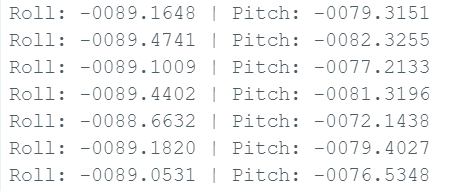

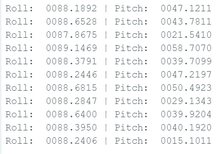

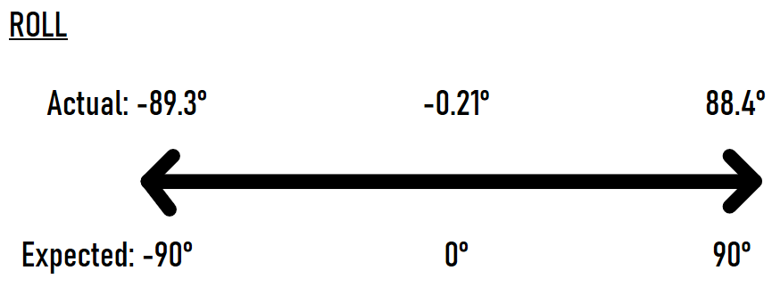

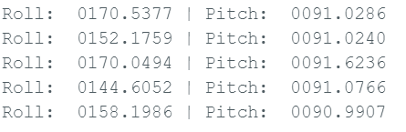
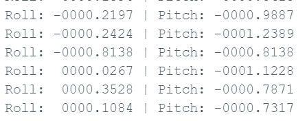
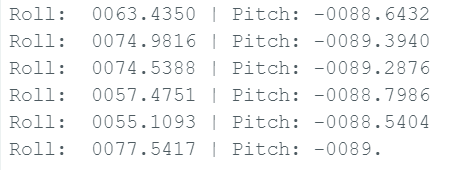


## Data Speed and Accuracy
Overall, the IMU is able to output accelermoter values very quickly and decently accurately. Raw acceleromter values are constantly changing and very noise. Even slight bumps in the table are detected with extreme changed in the accelerometer readings. An easy way to fix this is to low pass the accelerometer to filter out the noise. We start by observing stationary accelerometer readings in the frequency domain. We apply a fast fourier transformation to transform the data into the frequency domain. I attempted to sample 2048 accelerometer readings at a semi constant rate which ended up being about 1329 microseconds between data reads. 

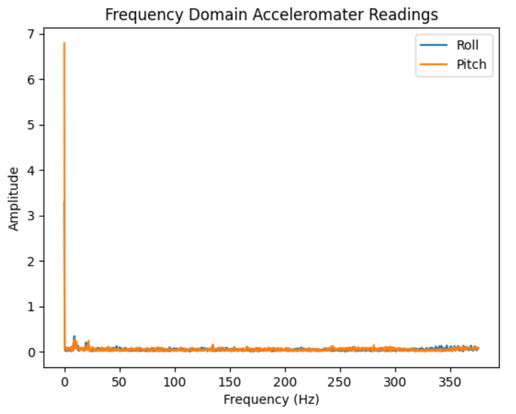
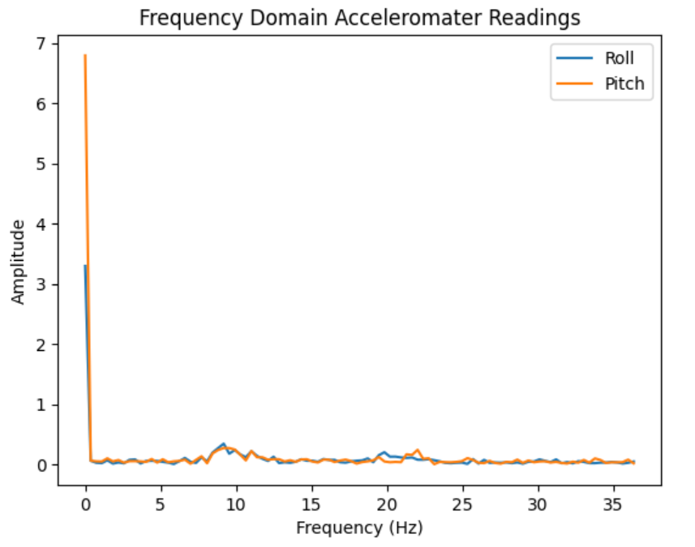


```python
f = np.linspace(0, fs/2, int(N/2), endpoint=False) 
roll_fft = fft(rolls)
pitch_fft = fft(pitches)
roll_y = 2.0 / N * np.abs(roll_fft[:N//2])
pitch_y = 2.0 / N * np.abs(pitch_fft[:N//2])
```

I noticed that all data seemed to be contained within 10 Hz so I chose to make this my cutoff. Sticking with the SciPy library, I used the built in `butter` and `filtfilt` functions to low pass the accelerometer values. This showed accelerometer readings that were far more resistant to noise as shown in the graph below.

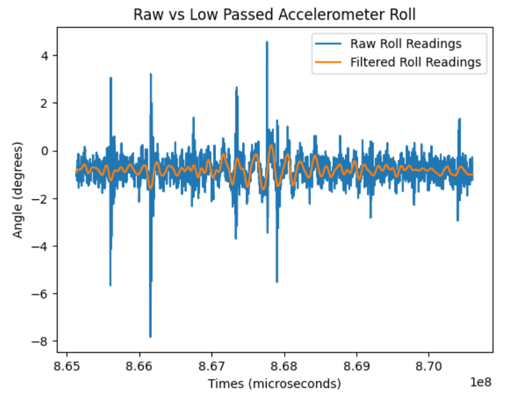
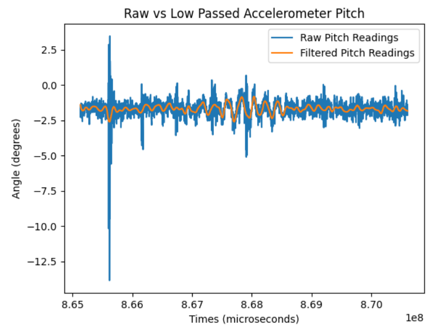

# Gyroscope

## Raw Gyroscope Readings
A gyroscope measures angular velocity. By updating out angle estimate based on time, the gyroscope readings, and the previous angle, we can accurately estimate the angle with far less noise. To estimate angle $\theta$ with the gyroscope, we can use the following equation $\theta_t = \theta_{t-1} + $ gyro_reading $ * dt$. This updates the angle based on the change between the last angle and the current. We can observe that when the imu is stable, we see little to no fluctuation in the gyroscope angle estimates. However, a major issue with relying only on the gyroscope is the value drifting from reality. Since we are estimating the position through the deriviative, we can easily stray from reality as the same estimates in our error compound.

<!-- 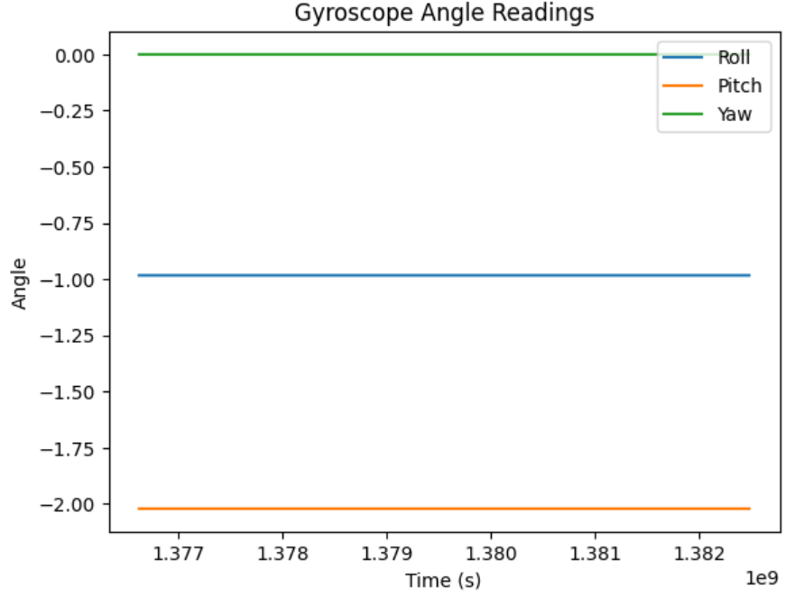 -->


<!-- 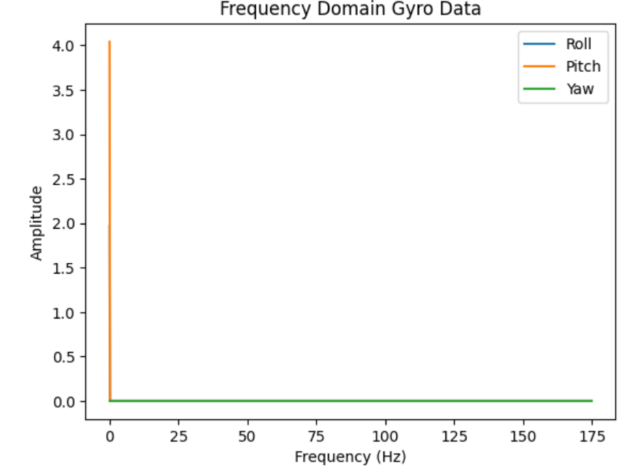
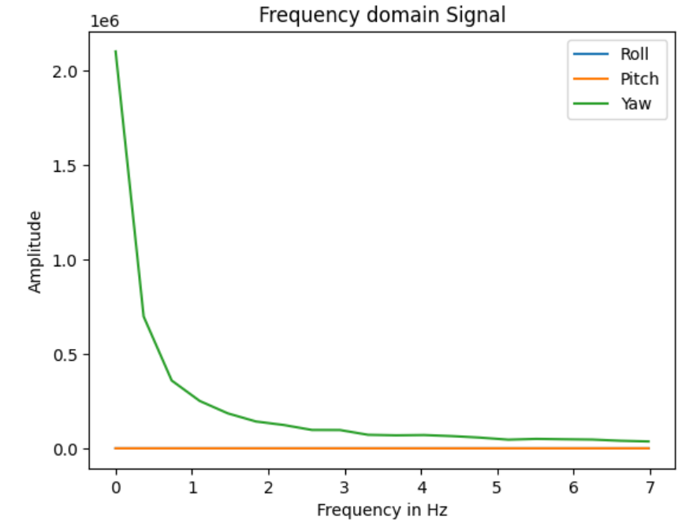 -->


Here's an example of gyroscope readings as I spin the IMU 360 degrees on the yaw axis.


## Sample Time


## Complementary Filter Readings
The solution to account for both the noise in the accelerometer and the drift in the gyroscope is to use a complementary filter. A complementary filter is simply a way of combinding the output for both the accelerometer and the gyrpscope to get non-noisy and accurate angle readings. We do this by taking the weighted average of the accelerometer and gyroscope angle estimates. I chose to take 99% of the gyroscopes reading since it would update quickly and not be noisy. I used 1% of the angle to be the acceleromter's reading to correct any drift introduced by the gyroscope. We can see in the graphs below that the complementary filter greatly improved both angle drift and resistanct to noise for the IMU readings. Light vibrations of the table no longer cause the angle to fluctuate and the gyroscope's drift is adjusted for (as demonstrated clearly in the pitch graph below).

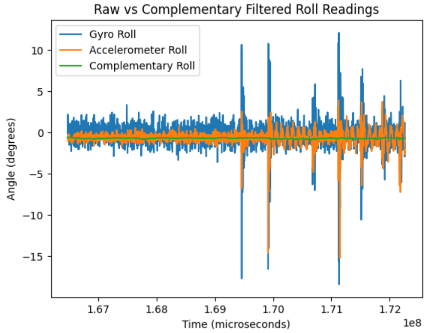

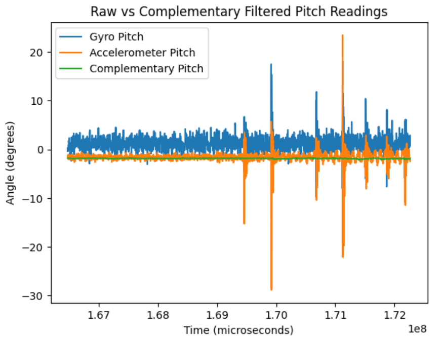

<iframe width="560" height="315" src="https://www.youtube.com/embed/32TD-UA93Og?si=4qZrD1Zmu8zUUgkA" title="YouTube video player" frameborder="0" allow="accelerometer; autoplay; clipboard-write; encrypted-media; gyroscope; picture-in-picture; web-share" referrerpolicy="strict-origin-when-cross-origin" allowfullscreen></iframe>

``` python
fs = 1/2827e-6
cutoff_freq = 10 
Wn = cutoff_freq / (fs / 2)
b, a = butter(N=4, Wn=Wn, btype='low')
comp_accel_roll_filtered = filtfilt(b, a, comp_acc_rolls) # filter the acceleration roll
comp_accel_pitch_filtered = filtfilt(b, a, comp_acc_pitches) # filter the acceleration pitch
comp_roll = np.zeros(2048)
comp_pitch = np.zeros(2048)
comp_roll[0] = comp_accel_roll_filtered[0]
comp_pitch[0] = comp_accel_pitch_filtered[0]

# calculate the complementary filter angles
for i in range(1, 2048):
    dt = (comp_times[i] - comp_times[i-1]) * 0.000001
    comp_roll[i] = (comp_roll[i-1]+ comp_gyr_rolls[i]*dt)*(0.99) + comp_acc_rolls[i]*0.01
    comp_pitch[i] = (comp_pitch[i-1]+ comp_gyr_pitches[i]*dt)*(0.99) + comp_acc_pitches[i]*0.01
```

One design choice I made was to do the complementary filter math in python rather than on the Artemis. I chose to do this because I wanted to transmit IMU data as quickly as possible and I wanted to be able to low pass and calibrate the accelerometer readings before passing them into the complementary filter. 

# Sample Data
To continously sample data, I created the commands `IMU_START` and `IMU_STOP`. The IMU will record and send out data in batches until it receives the stop command. I chose a batch size of 10 to minimize latency while transmitting mostly up to data readings. This resulted in a sampling rate of about 48.6 milliseconds between data points. 

<!-- 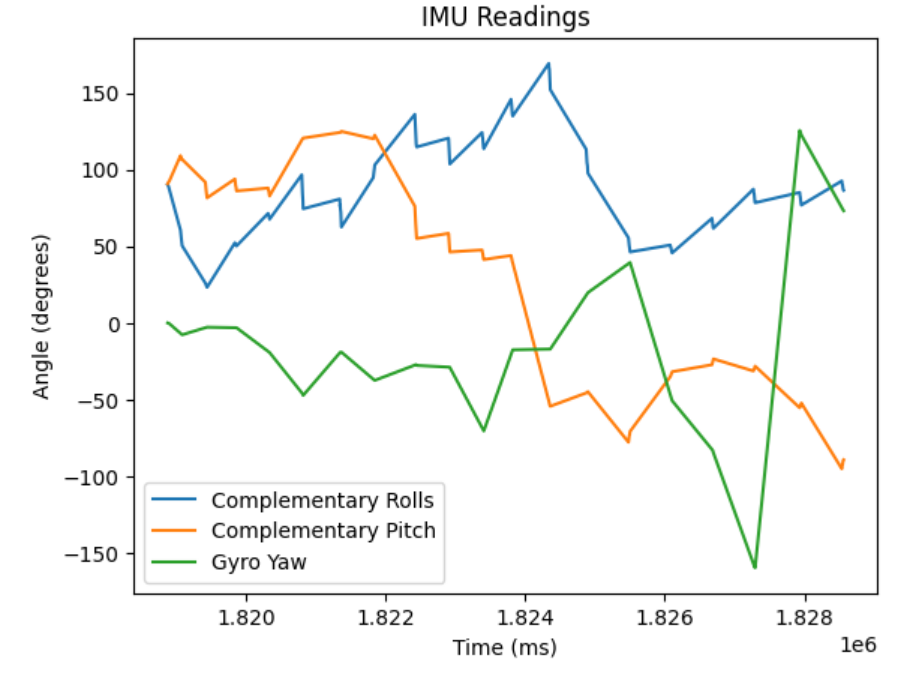 -->


``` c
// START STORING VALUES. TRANSMIT WHEN THE BUFFER IS FULL
void transmit_imu_data(){
    int dropped_data = 0;
    int j = 0;
    time_stamps[0] = (int) millis();

    for (i = 0; i < TIME_ARR_SIZE; i++) {
        if (myICM.dataReady()) {
          myICM.getAGMT();
          time_stamps[i] = (int) millis();
          roll_readings[i] = roll_calc_accel(&myICM);
          pitch_readings[i] = pitch_calc_accel(&myICM);
          gyro_roll_readings[i] = myICM.gyrX();
          gyro_pitch_readings[i] = myICM.gyrY();
          gyro_pitch_readings[i] = myICM.gyrY();
          gyro_yaw_readings[i] = myICM.gyrZ();
        }
        else{
          dropped_data++;
        }
        read_data();
        if (!imu_trans){
          break;
        }
    }         
      
    // Serial.println("SENDING IMU DATA");

    for (j = 0; j < i; j++) {
        tx_estring_value.clear();
        tx_estring_value.append(time_stamps[j]);
        tx_estring_value.append(":");
        tx_estring_value.append(roll_readings[j]);
        tx_estring_value.append(":");
        tx_estring_value.append(pitch_readings[j]);
        tx_estring_value.append(":");
        tx_estring_value.append(gyro_roll_readings[j]);
        tx_estring_value.append(":");
        tx_estring_value.append(gyro_pitch_readings[j]);
        tx_estring_value.append(":");
        tx_estring_value.append(gyro_yaw_readings[j]);
        tx_estring_value.append(":");
        tx_estring_value.append(dropped_data);
        tx_characteristic_string.writeValue(tx_estring_value.c_str());
    }       

    // Serial.println("COMP DATA TRANFER Complete");
}
```


# Stunt

After playing around with my RC car, I observed the car's natural drifting, turning speed/accuracy, and how easy it was to flip the bot over (either by driving into a wall or rapidally switching directions). I noted that telling the bot to drive 'straight' resulted in the car taking a pretty heavy curve. It was pretty easy to get the car to only have 1 or 2 wheel touching the ground causing a straight command to result in the car spinning in a circle (as shown in the video).


<iframe width="560" height="315" src="https://www.youtube-nocookie.com/embed/GcuW-iUdXQA" title="YouTube video player" frameborder="0" allow="accelerometer; autoplay; clipboard-write; encrypted-media; gyroscope; picture-in-picture" allowfullscreen></iframe>

Shao and I also (accidently) observed that the RC car can drive on its side. I'm not sure what to do with this information at this time, but it could be used for a stunt in the future. Driving on the side seemed much more controlled and better for slower motion. (Please ignore my cackling as I found this driving method to be quite funny).

<iframe width="560" height="315" src="https://www.youtube-nocookie.com/embed/oYaDFxAgCsQ" title="YouTube video player" frameborder="0" allow="accelerometer; autoplay; clipboard-write; encrypted-media; gyroscope; picture-in-picture" allowfullscreen></iframe>

# Collaboration
This lab was worked on with consultation from Shao Stassen. We worked together more closely for the Stunt section. Aidan McNay's student page was also consulted. 

## Resources

[Qwiic Connect Guide](https://www.sparkfun.com/qwiic)

[ArduinoDocs I2C Guide](https://docs.arduino.cc/learn/communication/wire/)

[Alphabold FFT Tutorial](https://www.alphabold.com/fourier-transform-in-python-vibration-analysis/#elementor-toc__heading-anchor-1)

[SciPy Butter](https://docs.scipy.org/doc/scipy-1.17.0/reference/generated/scipy.signal.butter.html)

[SciPy Filtfilt](https://docs.scipy.org/doc/scipy-1.17.0/reference/generated/scipy.signal.filtfilt.html)